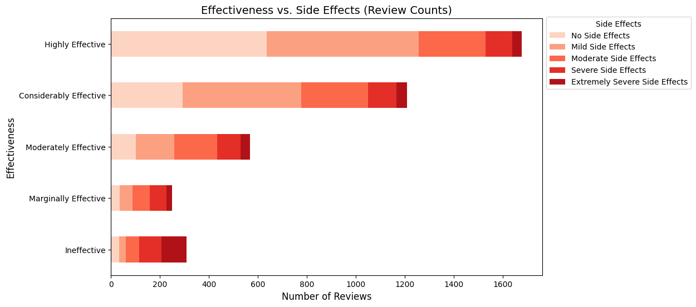
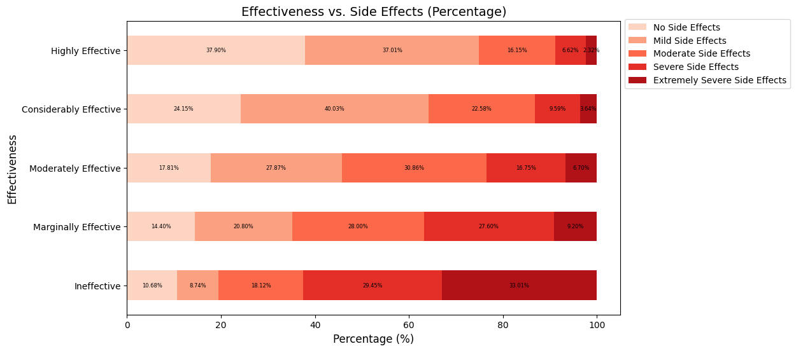
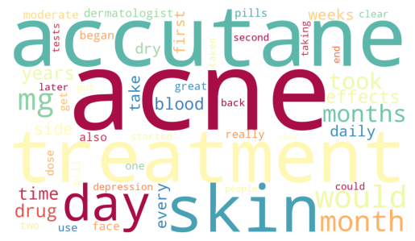
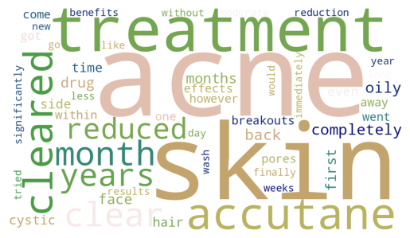
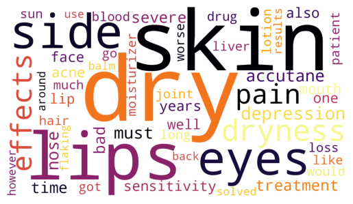
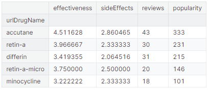
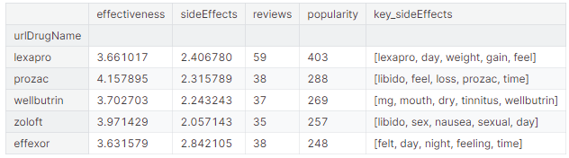
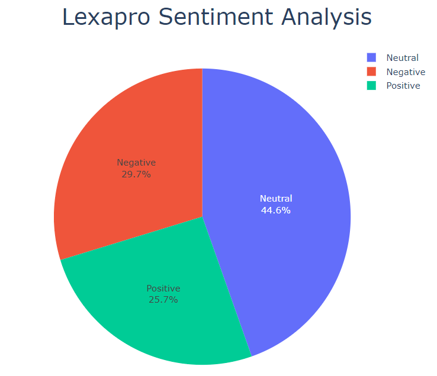

# Drugs-Review

In this repo, you can look on how I will do Exploratory Data Analysis, visualization on reviews using WordCloud, keywords extraction, and sentiment analysis. You could also see the dataset that I used here: 🌟[Patient Ratings: Identifying Best Drugs!](https://www.kaggle.com/datasets/rabieelkharoua/patient-ratings-identifying-best-drugs)

I will summarize my findings and insights here, to see the code you can click the .ipynb file that I provided here.

## Drug's Effectiveness vs Side Effects

  

  

## The Most Popular Drug Used to Treat Acne Problems: Accutane

  

  

  

  

## The Most Popular Drug Prescribed to Treat Depression: Lexapro

  

  

## Future Development

- Write a Python script build interactive dashboard using Dash to get insights on each drug
- Include another dataset from Drugs.com
