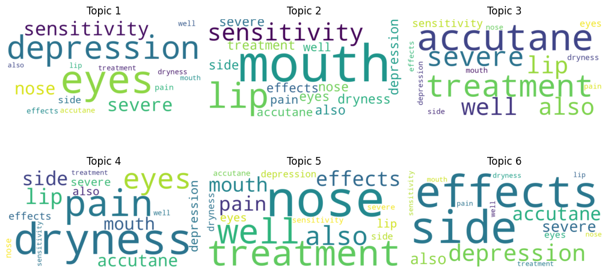

# Drugs-Review

In this repo, you can look on how I will do Exploratory Data Analysis, visualization on reviews using WordCloud, keywords extraction, and sentiment analysis. You could also see the dataset that I used here: 🌟[Patient Ratings: Identifying Best Drugs!](https://www.kaggle.com/datasets/rabieelkharoua/patient-ratings-identifying-best-drugs)

I will summarize my findings and insights here, to see the code you can click the .ipynb file that I provided here.

## Drug's Effectiveness vs Side Effects

  

  

Does effectiveness correlate with side effects? **Yes, it does!** The data shows that as **drug effectiveness rises**, **severe side effects decline** while **no or mild side effects increase** notably, with highly effective drugs showing the most favorable profile.

What about ratings given by the consumer? It is shown that **rating has positive correlation with effectiveness** while having a **negative correlation with side effects**. Also, the effectiveness of a drug has a slightly stronger correlation than side effects, meaning that Highly Effective drugs will probably guarantee their ratings no less than 7.

  

  

## The Most Popular Drug Prescribed to Treat Depression: Lexapro

I tried to dig deeper into a few certain medical conditions to gain more insights, one of them is *depression*. Here are the top 5 drugs prescribed to treat depression.

  
<b>Top 5 Drugs Prescribed for Depression</b>

  

I used Term Frequency - Inverse Document Frequency (TF-IDF) to extract a few keywords on the sideEffects column to give some information regarding the side effects of each drug. In short, TF-IDF quantifies the importance of a word in a document by considering how often it appears in that document (term frequency) and how rare it is across all documents (inverse document frequency). This helps to highlight words that are more informative and less common across the entire corpus. From what I've gathered using TF-IDF, *Lexapro* might cause weight gain to the patients, and *Zoloft* might cause side effects to libido and nausea. Let's look into *Lexapro* a little bit further!

  
<b>Lexparo Medical Conditions</b>

  

Using word cloud visualization on *Lexapro* data, it looks like not only to treat depression but *Lexapro* can be prescribed to treat anxiety, PTSD, and panic attacks.

  

Using sentiment analysis, we can see that *Lexapro* generally received a mixed reviews. Most of them can be viewed as neutral, followed by negative and positive reviews.

## The Most Popular Drug Used to Treat Acne Problems: Accutane

Next, I would like to dwell into acne treatment drugs. Here are the top 5 drugs prescribed to treat acne and the most popular is *Accutane*

  
<b>Top 5 Drugs Prescribed for Acne Treatment</b>

  

Generally, *Accutane* might cause dry skin judging by what keywords can be extracted from sideEffects column. It is further strengthen by the word cloud visualization below. The word cloud also strengthen the *Accutane** reputation in our dataset as the most popular acne treatment drugs since the reviews display a lot of "cleared", "reduced", "completely", and "significantly".

  
<b>Accutane Reviews</b>

  

  
<b>Accutane Benefits</b>

  

  
<b>Accutane Side Effects</b>

  

I tried to analyze a little bit further by using Latent Dirichlet allocation model (LDA). LDA is a probabilistic model that identifies hidden topics within a set of documents by assuming that each document is a combination of multiple topics and each topic is characterized by a distribution of words. This allows for the discovery of abstract topics that explain the patterns of word occurrence in the documents.

  
<b>Accutane 5 Main Topics in Side Effects Section</b>

  

There are 5 topics that i extracted, the consumers usually talks about dry skin in the sideEffects section but interestingly there are some mentions about depression. If we look into the raw data, there are a few comments about *Accutane* causing depression.

## Future Development

- Include another dataset from Drugs.com
- Write a Python script build interactive dashboard using Dash to get insights on each drug
